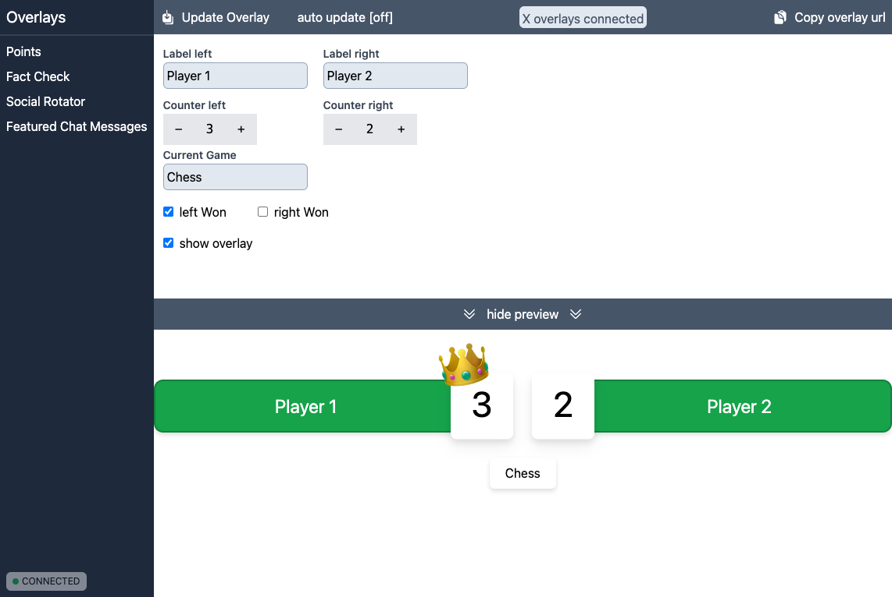

# Open Overlays



This project is in a very early stage!

It is focusing on the creation of overlays for Streaming.

## Project Structure

The Frontend is written in Vue 3 with Tailwind as CSS Framework. The Backend is written with Nestjs. The communication between them is handled via REST Calls and WS Call (using Socket.io)

## Start the project

### frontend

``` bash
npm install
npm run dev
```

### backend

``` bash
cd nest-backend
npm install
npm run dev
```
